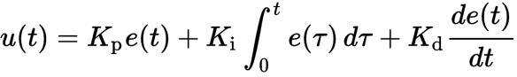

PID Controller
===

### Introduction

PID controller or Proportional–Integral–Derivative controller is a control loop mechanism. It calculates an cross-track error or controller error `e(t)` of a target state value `u(t)` and measured state value `m(t)` as `e(t) = u(t) - m(t)`. The result of PID controller is output . Sometimes PID controller is named as PSD or proportional-summation-difference, because algorithm calculates integral as summation of errors over `t` and derivative as difference between previous error and current one.

### Terms

* **Proportion term**. The proportion term defines direction and how fast the algorithm should compensate the error. It is easy to overshoot using only this gain and as a result the control output oscillates around target value. The proportion parameter `Kp` is non-negative number.
* **Integral term**. Integral gain addresses how long and how far measured value has been from the goal. The integral term sums error `e(t)`. If even a small error persists, the total sum will grow and influence the control output. The integral parameter `Ki` is non-negative number.
* **Derivative term**. The derivative term, in fact, irons the oscillation made by proportion term. More precisely, it represents how fast the error is changin at current moment. Employing error changing rate, the derivative term alleviates overshooting caused by proportion term. The derivative `Kd` parameter is non-negative number.

### Tuning

Nowadays plenty number of algorithms are available for tuning PID controller coefficients. Moreover, some approaches provide auto-tuning properties, thereafter the PID controller can be adjusted in real time depending on magnitude of the cross-track error. You can find auto-tuning PID implementations [here](http://uk.mathworks.com/matlabcentral/fileexchange/4652-autotunerpid-toolkit?requestedDomain=www.mathworks.com) or [here](http://playground.arduino.cc/Code/PIDLibrary).

I started with Twiddle algorithm which was advertised in Udacity course as simple and stable. I was not satisfied with final results, because it was even very bad as a starting point for parameters in further hand-crafting.

I set eyes on [Ziegler–Nichols method](https://en.wikipedia.org/wiki/Ziegler%E2%80%93Nichols_method) discovered back in 1949. It has even more simple and precise rules to achieve efficient and semi-optimal values of coefficients. Here they are:

1. Turn off **I** and **D** terms. In other words set `Ki = 0` and `Kd = 0`.
2. Set `Kp = 0` and increase it slowly until the control output exhibits sustained oscillations. At this step we get our critical proportion gain. In my case, I increased value manually from _0_ to _0.5_ with interval _0.1_ and stopped at _0.3_.
3. **ZN** method also requires to cast period of time. I set up it to _100ms_.
4. Turn on **I** and **D** components by using values from **ZN** table: `Kp = 0.6 * critical_gain = 0.18`, `Ki = 0.5 * time_period = 50` and `Kd = 0.13 * time_period = 13`.

I used this values as starting point for further hand-craft tuning. I noticed that PID controller doesn't react at all if integral component is set to zero, so I concluded that steering angle is free from bias and assigned small value _0.00001_ to it. The final coefficients I have got: `Kp = 0.1`, `Ki = 0.00001` and `Kd = 1.45`. But through it all, the car had sudden and quick movements, especially on turns. When added [exponential smoothing](https://en.wikipedia.org/wiki/Moving_average#Exponential_moving_average) to PID control output, the bizarre discrete car turns almost disappeared.

[Video](https://drive.google.com/open?id=0B90SlGxx-BAeZjlTZEd5a0dHczQ) how car finishes track successfully.

### Experiments

You can see below some experiments with changing P, I, and D parameters. Initial optimized values were `P = 0.1`, `I = 0.00001`, `D = 1.45`:

* Effect of P component. Changed from _0.1_ to _1_. Oscillation increases overtime leading to loosing control and to the crash in the end.

* Effect of I component. Changed from _0.00001_ to _0.5_. It had kind of comic consequence. The car pulled off the road and made its way next to it.

* Effect of D component. Changed from _1.45_ to _20_. Whatever value I tried car always could finish the racetrack. Output control oscillation is around irrespective our senses. No matter how smoothly car is moving, output wiggles near to setpoint (target value). High D component hardly tries to balance "micro" error, but instead we observe car shaking on the road.

